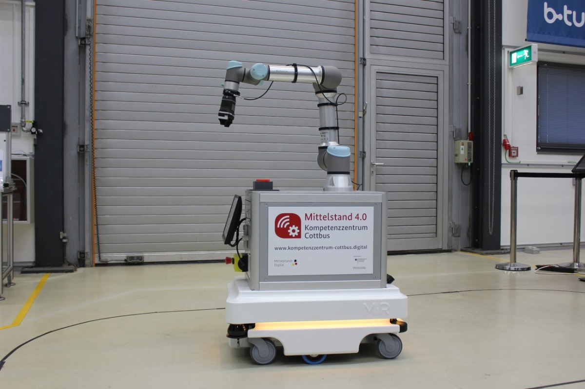

# MEC-Sandbox (Multi-Access Edge Computing)
A Playground to learn coding within a Multi-Access Edge Computing Application
## The roadmap
* Step 1: Setting up an MVP (Minimum Viable Product): All Raspberry Pi's and cameras are accessible and programmable for users, the cameras are mounted on aluminum profile stands. the respective scripts on the Pi's are programmed monolithically (classic large code blocks). Three scripts are programmed (AI-based object/contour recognition, communication with robot and quality control with depth-image camera)
* Step 2: Launch a project wiki: Newcomers should be able to familiarize themselves independently with the well-documented environment.
* Step 2: transfer code blocks into Docker containers, demonstrate how quickly the programs can be deployed on new hardware without having to install tons of libraries.
* Step 3: a simple GUI on which the video streams of the RPi's are displayed
* Step 4: A Master Raspberry Pi, equipped with a dashboard (based on the previous step) and the Kubernetes container composition software manages and monitors the processes of each Raspberry. At this point we are actually in multi-access edge computing.
* Step 5: Convert monolithic code blocks into microservices (large blocks of code are divided into independent processes that communicate with each other using language-independent programming interfaces. The services are largely decoupled and perform a small task)
* Step 6: Introduce version control to be able to switch between different "branches". Beginners can thus switch to the more understandable classic monolithic code structure from step 1 with a single click, while advanced users can further develop and understand the microservice architecture. Version control is done via GitHub, which allows multiple people to work on a repository (project folder with code) at the same time, and each code extension is documented and can be reversed.
* Step 7: Generate a (good looking) demonstrator from the development environment. Similar to the KUKA Innovation Award, an end effector with integrated Raspberry Pi (contains all modules), accelerator, camera and gripper is developed, which can be coupled to any UR by a quick release. Thus both camera aluminum profile stands can be omitted and the development environment becomes a mobile application.
>> Why is the last step not done first? Fully integrated systems are difficult to program, because debugging requires access to the hardware at all times and complexity should be kept low (3 differentiable Raspberry Pi's instead of one single one)


## Tasks
#### 1. Develop a contour detector 
... that detects contours of rectangles and calculates their angles like this:


Start coding in the File [contour_detector.py](contour_detector.py) 
Use Stackoverflow to find help, check out this [potential solution](https://stackoverflow.com/questions/34237253/detect-centre-and-angle-of-rectangles-in-an-image-using-opencv)

#### 2. Develop a QR-Code detector
... to detect not only the position of the sticker but also the orientation matrix (how it is rotated). 
Kind of like the below image (notice the coordinate system, thats what we want to get):


Start coding in the File [qr_code_detector.py](qr_code_detector.py)

Try to use cv2.getPerspectiveTransform on the four edges of the qr-code in relation to a standard square. Use [PyImagesSearch's](https://www.pyimagesearch.com/2014/08/25/4-point-opencv-getperspective-transform-example/) solution (and credit him in the code). 

```cv2.getPerspectiveTransform``` returns a rotation matrix which we can transform into a roation vector with Scipy. Therefore use 
```
dst = np.array([
           [0, 0],
           [maxWidth - 1, 0],
           [maxWidth - 1, maxHeight - 1],
           [0, maxHeight - 1]], dtype = "float32")
M = cv2.getPerspectiveTransform(the_four_corner_points_of_the_qr_code, dst) # returns a 3x3 matrix 
rotation_vector = R.from_matrix(M).as_rotvec(degrees=True) # returns [Rx,Ry,Rz]
```   
When we feed the ```rotation_vector``` Variable to the robot (Universal Robots UR5) we will be able to calibrate the robot to the external camera and even create AR-Applications
Wrap the whole code into a function that returns 
* the pixel coordinate of the middle of the qr-code
* the rotation vector
* the maxWidth variable (that will be used later to calculate the height of the camera relative to the robot)

#### 3. Connect to the robot to use a QR-Code to calibrate and then pick up a cube with the contour detector
lets hoock up to the Universal Robots UR5



... to be continued

