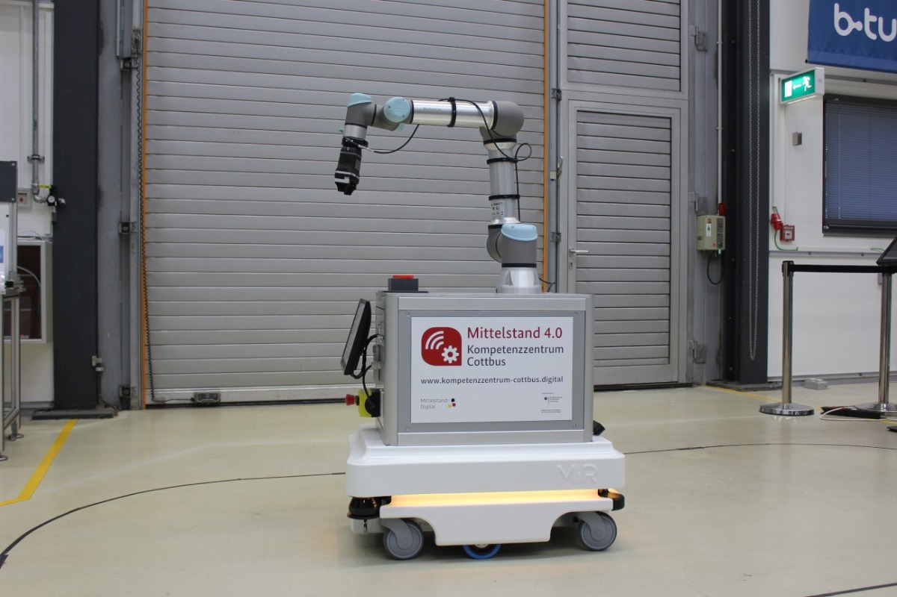

# MEC-Sandbox (Multi-Access Edge Computing)
A Playground to learn coding within a Multi-Access Edge Computing Application
## The roadmap
* Step 1: Setting up an MVP (Minimum Viable Product): All Raspberry Pi's and cameras are accessible and programmable for users, the cameras are mounted on aluminum profile stands. the respective scripts on the Pi's are programmed monolithically (classic large code blocks). Three scripts are programmed (AI-based object/contour recognition, communication with robot and quality control with depth-image camera)
* Step 2: Launch a project wiki: Newcomers should be able to familiarize themselves independently with the well-documented environment.
* Step 2: transfer code blocks into Docker containers, demonstrate how quickly the programs can be deployed on new hardware without having to install tons of libraries.
* Step 3: a simple GUI on which the video streams of the RPi's are displayed
* Step 4: A Master Raspberry Pi, equipped with a dashboard (based on the previous step) and the Kubernetes container composition software manages and monitors the processes of each Raspberry. At this point we are actually in multi-access edge computing.
* Step 5: Convert monolithic code blocks into microservices (large blocks of code are divided into independent processes that communicate with each other using language-independent programming interfaces. The services are largely decoupled and perform a small task)
* Step 6: Introduce version control to be able to switch between different "branches". Beginners can thus switch to the more understandable classic monolithic code structure from step 1 with a single click, while advanced users can further develop and understand the microservice architecture. Version control is done via GitHub, which allows multiple people to work on a repository (project folder with code) at the same time, and each code extension is documented and can be reversed.
* Step 7: Generate a (good looking) demonstrator from the development environment. Similar to the KUKA Innovation Award, an end effector with integrated Raspberry Pi (contains all modules), accelerator, camera and gripper is developed, which can be coupled to any UR by a quick release. Thus both camera aluminum profile stands can be omitted and the development environment becomes a mobile application.
>> Why is the last step not done first? Fully integrated systems are difficult to program, because debugging requires access to the hardware at all times and complexity should be kept low (3 differentiable Raspberry Pi's instead of one single one)

## Getting Started
our Multi-Access Edge Computing Sandbox has been set up in the laboratory. For now a raspberry pi is connected to a PiCamera which shall be used to detect objects, calculate their contours/positions and even calibrate the camera position to a robots TCP simply by showing a QR-Code. Later we will add 3D cameras and neural network inferencing devices like an edge TPU from Google Coral.
To get started, you can use your own laptop to develop applications or use the Raspberries in the laboratory (they are all set up).

The first steps to prepare your computers for coding could be to:
1. Install [GitHub for Desktop](https://desktop.github.com/)
2. Install the [Atom IDE](https://atom.io/)
3. Clone the repository with GitHub for Desktop using the link of this repository (https://github.com/Multi-Access-Edge-Computing-Playground/MEC-Sandbox.git)
4. Install [Python](https://www.python.org/ftp/python/3.7.9/python-3.7.9-amd64.exe) (Version 3.7)
>> while walking through the install wizard make sure to enable PATH

5. Install some libraries by opening the Terminal (on Windows: search for cmd in the start-search) and execute the following commands:
```
pip install opencv-python
pip install numpy
pip install scipy
```
6. Run a test program:
>> The most basic and the easy way to run Python scripts is by using the python command. You need to open a command-line and type the word python followed by the path to your script file (GitHub Desktop will show you where it cloned the repository to), like this: 
```python C:\Users\fabian\Documents\GitHub\MEC-Sandbox\contour_detector.py```
Then you hit the ENTER button from the keyboard and that's it. You can see now your webcam-stream on the screen. Stop the program by hitting q on your keyboard. Congrats! You just ran your first Python script.

7. dive into Python and learn to code. 
>>Check out our [Teams-Board](https://teams.microsoft.com/l/entity/com.microsoft.teamspace.tab.planner/_djb2_msteams_prefix_921253025?context=%7B%22subEntityId%22%3Anull%2C%22channelId%22%3A%2219%3Ab3c07338ca614247a2fc1ed8ee32d4ff%40thread.tacv2%22%7D&groupId=5477e372-0e90-4ce4-942c-5a6c484efea7&tenantId=509b255b-13b3-4af4-bd94-9536cca3c61f) to find a course on Python, GitHub and OpenCV that gets you started and enables you to adapt the code (Members only). 

Everybody is invited to tackle the tasks below and upgrade the code. To do so it is best if you join the GitHub Team (yes, another account has to be created...). Here we can collaborate on the codebase like real developers without breaking anything.
--> Send me an E-Mail to join the repository and collaborate.
With GitHub Desktop and Atom you can commit new Code to the GitHub-Cloud and synchronize the latest changes.

Whoever has some code, no matter what language, that can be shipped (like webservers for object detection @Kai), feel free to share within the GitHub repository. It might be useful to have a codebase that features all the code of the chair of automation in one place. We can even keep the repository private so only staff and students can access the content. (However for now it will be open to public for an easier access)

## Tasks
#### 1. Develop a contour detector 
... that detects contours of rectangles and calculates their angles like this:


Start coding in the File [contour_detector.py](contour_detector.py) 
Use Stackoverflow to find help, check out this [potential solution](https://stackoverflow.com/questions/34237253/detect-centre-and-angle-of-rectangles-in-an-image-using-opencv)

#### 2. Develop a QR-Code detector
... to detect not only the position of the sticker but also the orientation matrix (how it is rotated). 
Kind of like the below image (notice the coordinate system, thats what we want to get):


1. Start working through [this Tutorial](https://www.learnopencv.com/opencv-qr-code-scanner-c-and-python/) and try to run the code on your System. 
2. Adapt the program so that it reads a videostream from the webcam (check out google for the ```cv2.VideoCapture()``` class) to track a QR-Code. 
3. Try to use cv2.getPerspectiveTransform on the four edges of the qr-code in relation to a standard square. Use [PyImagesSearch's](https://www.pyimagesearch.com/2014/08/25/4-point-opencv-getperspective-transform-example/) solution (and credit the source in the code).

```cv2.getPerspectiveTransform``` returns a rotation matrix which we can transform into a rotation vector with Scipy (rotation vector is the way a universal robot defines n orientation in the workspace). Therefore use 
```
dst = np.array([
           [0, 0],
           [maxWidth - 1, 0],
           [maxWidth - 1, maxHeight - 1],
           [0, maxHeight - 1]], dtype = "float32")
M = cv2.getPerspectiveTransform(the_four_corner_points_of_the_qr_code, dst) # returns a 3x3 matrix 
rotation_vector = R.from_matrix(M).as_rotvec(degrees=True) # returns [Rx,Ry,Rz]
```   
(You will find this code context in the above [PyImagesSearch's](https://www.pyimagesearch.com/2014/08/25/4-point-opencv-getperspective-transform-example/) solution)

When we feed the ```rotation_vector``` Variable to the robot (Universal Robots UR5) we will be able to calibrate the robot to the external camera and even create AR-Applications
Wrap the whole code into a function that returns 
* the pixel coordinate of the middle of the qr-code
* the rotation vector
* the maxWidth variable (that will be used later to calculate the height of the camera relative to the robot)

#### 3. Connect to the robot to use a QR-Code to calibrate and then pick up a cube with the contour detector
lets hoock up to the Universal Robots UR5



... to be continued

